# XZ_R06.X

PIC16F1705 program for Rev.6 XZ PCB of CompactPnP

---
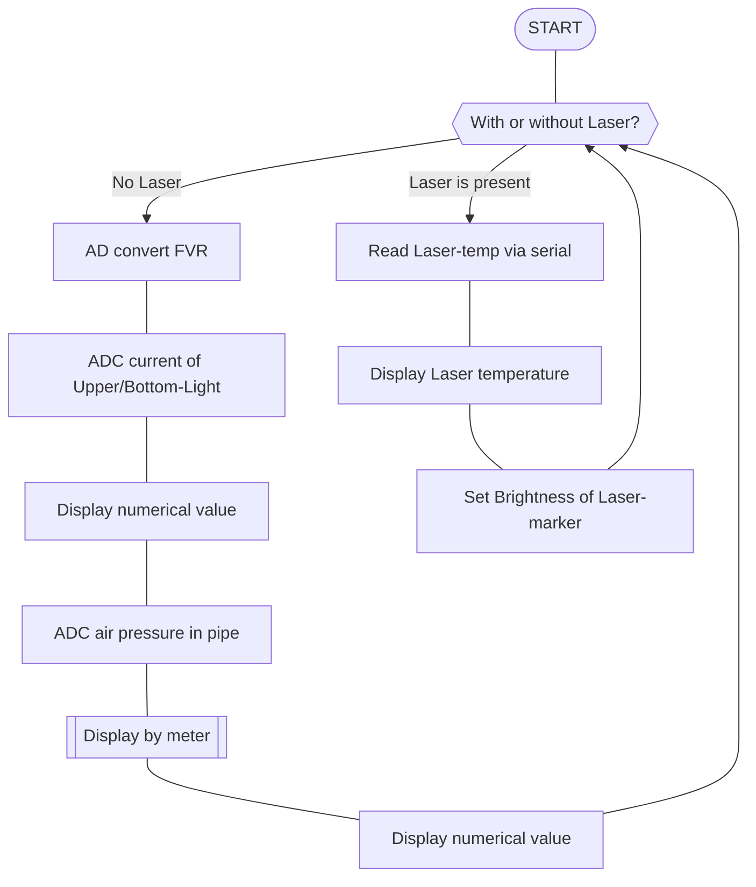
```mermaid
flowchart TD;
    I([START])---A;
    A{{With or without Laser?}}-->|No Laser|B[AD convert FVR];
    B---C[ADC current of Upper/Bottom-Light];
    C---E[Display numerical value];
    E---F[ADC air pressure in pipe];
    F---G[[Display by meter]];
    G---H[Display numerical value];
    H-->A;
    A-->|Laser is present|D[Read Laser-temp via serial];
    D---D2[Display Laser temperature];
    D2---D3[Set Brightness of Laser-marker];
    D3-->A;
```
---

*images 
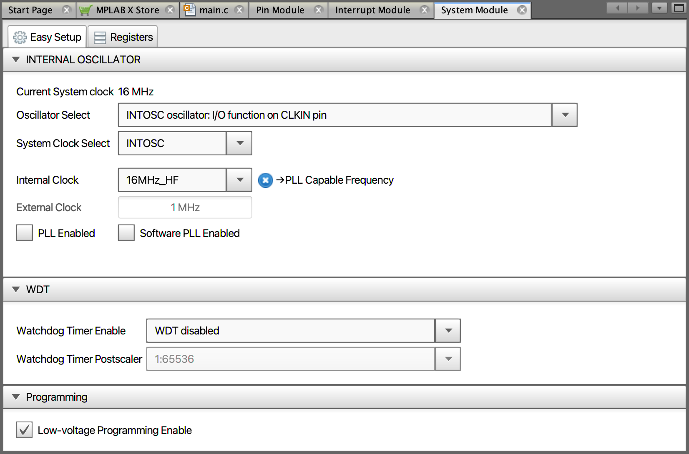
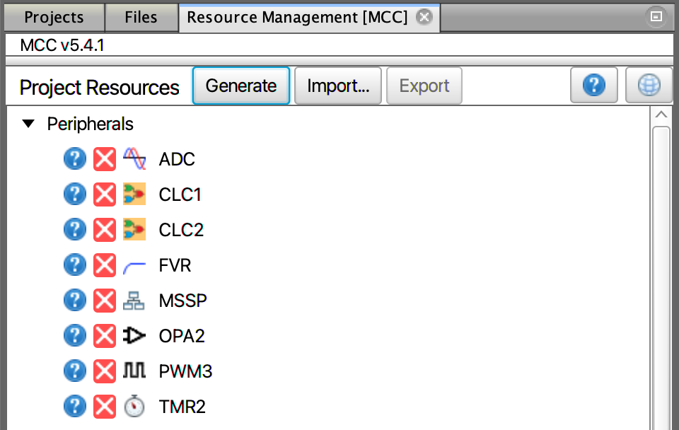
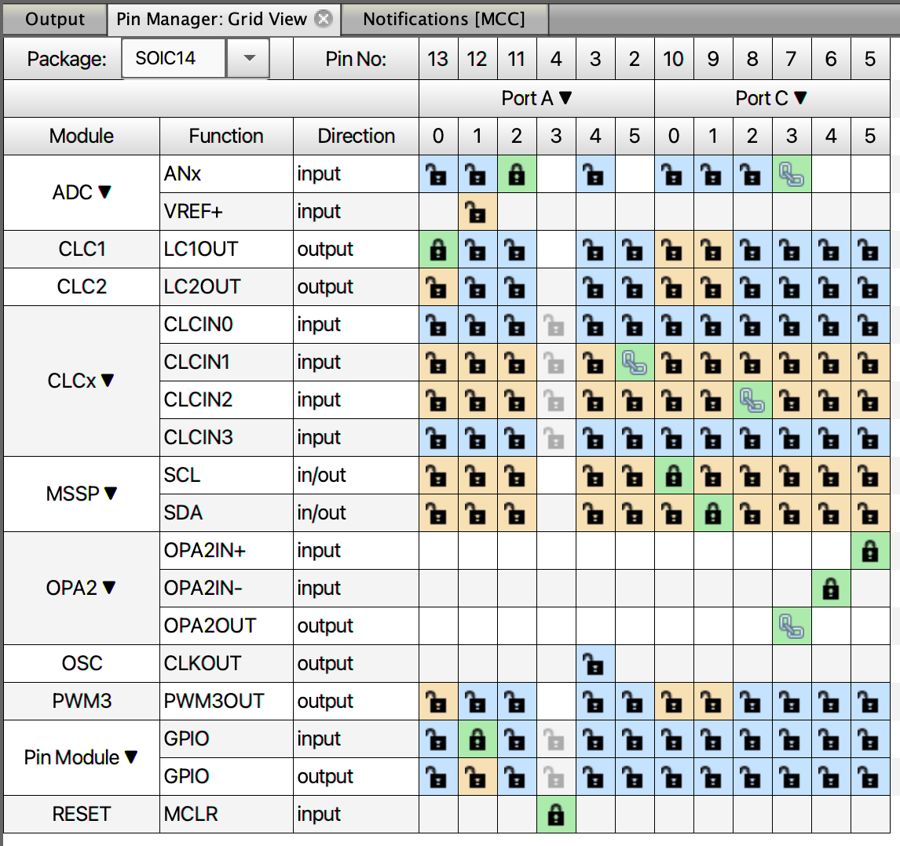
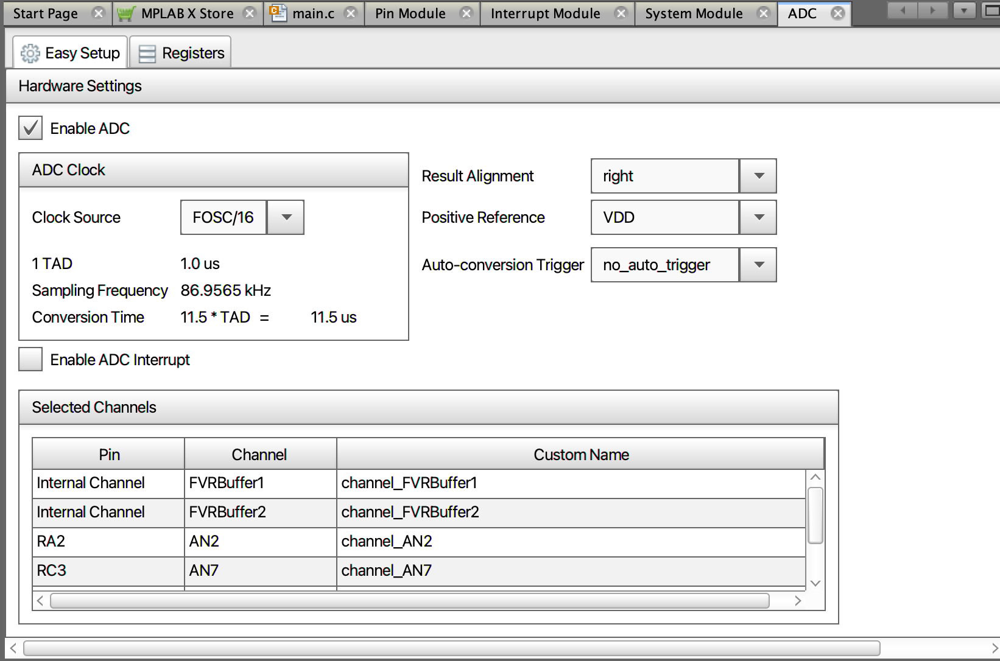
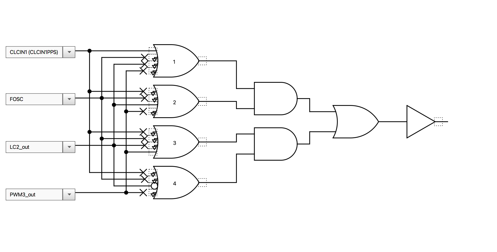
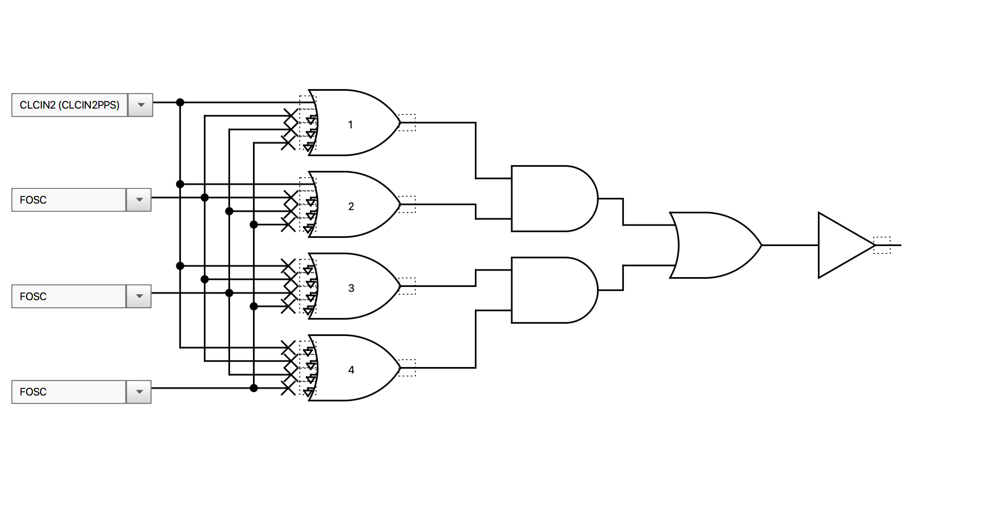
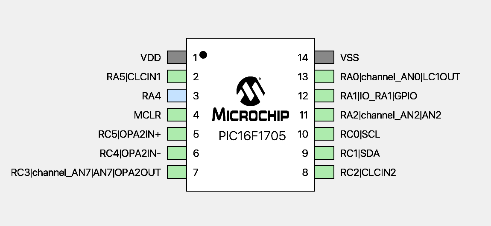
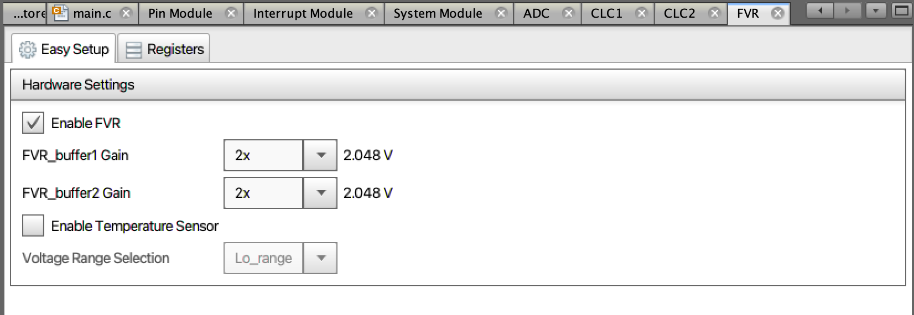
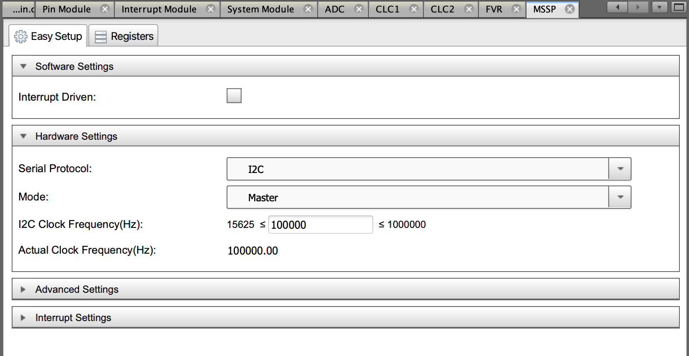
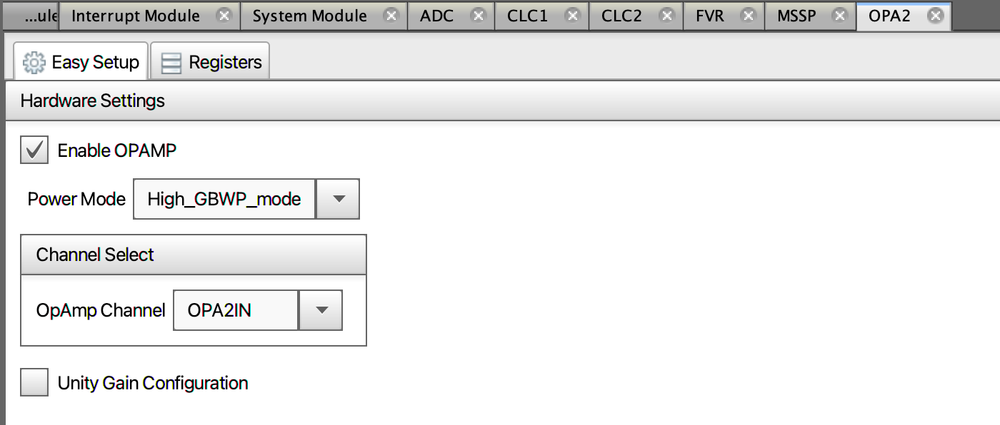
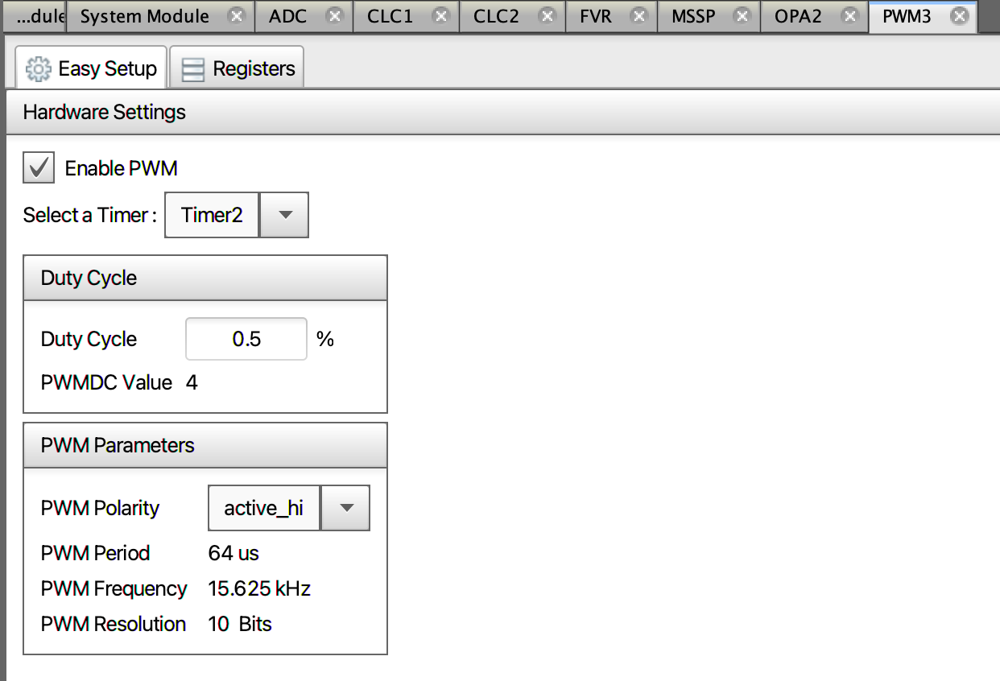
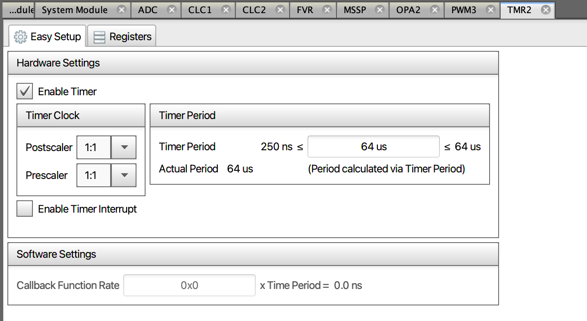
